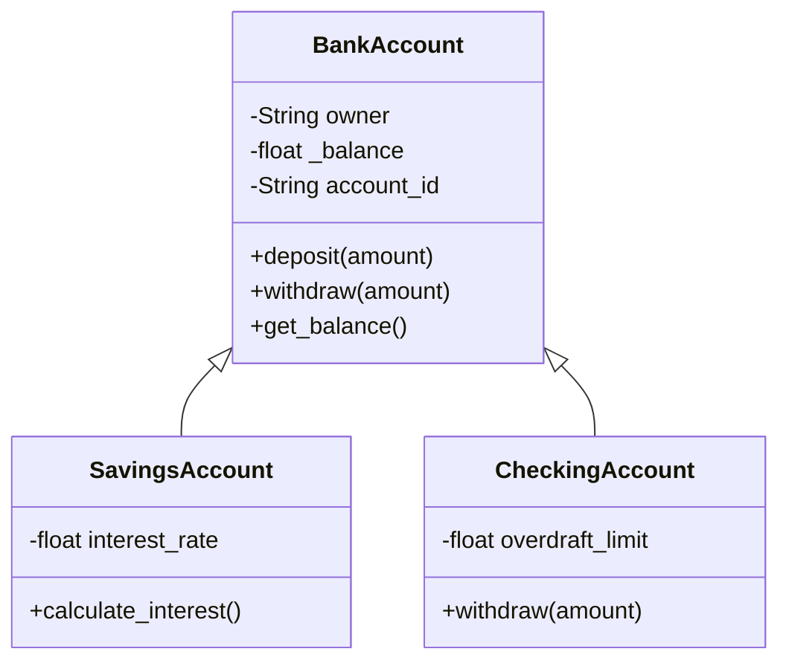

# 🚀 GitHub OOP-Projekte Professionell Lernen & Präsentieren
## Der Komplette Leitfaden für Arbeitgeber-Ready Portfolio

---

## 📋 INHALTSVERZEICHNIS

1. [Vorbereitung & Setup](#vorbereitung)
2. [Projekt Durcharbeiten - Die 5-Phasen-Methode](#5-phasen-methode)
3. [GitHub Repository Professionell Aufsetzen](#github-setup)
4. [Code-Qualität & Best Practices](#code-qualität)
5. [Dokumentation wie ein Profi](#dokumentation)
6. [Portfolio-Präsentation für Arbeitgeber](#portfolio)
7. [Beispiel-Workflow](#beispiel)

---

## 🛠️ PHASE 1: VORBEREITUNG & SETUP {#vorbereitung}

### 1.1 Lokale Entwicklungsumgebung einrichten

```bash
# Projektordner erstellen
mkdir python-oop-portfolio
cd python-oop-portfolio

# Git initialisieren
git init

# Python Virtual Environment erstellen
python -m venv venv

# Virtual Environment aktivieren
# Windows:
venv\Scripts\activate
# Mac/Linux:
source venv/bin/activate

# Basis-Tools installieren
pip install pytest black flake8 mypy
pip freeze > requirements.txt
```

### 1.2 GitHub Account professionalisieren

**Checkliste:**
- ✅ **Profilbild:** Professionelles Foto (kein Avatar)
- ✅ **Bio:** Kurze Beschreibung (z.B. "Python Developer | OOP & Web Development")
- ✅ **Location:** Stadt, Land
- ✅ **Website/LinkedIn:** Verlinken
- ✅ **README.md Profil:** Pinned Repository mit Vorstellung
- ✅ **Email verifiziert**

**Beispiel-Bio:**
```
🐍 Python Developer | Backend & OOP Specialist
📚 Learning: Django, FastAPI, Microservices
🎯 Building real-world projects | Open to opportunities
📍 Leipzig, Germany
```

### 1.3 GitHub Desktop oder Git Bash?

**Empfehlung für Anfänger:**
- **GitHub Desktop:** Visuell, einfach (Download: https://desktop.github.com/)
- **Git Bash:** Professioneller, mehr Kontrolle

**Wichtige Git-Befehle lernen:**
```bash
git status              # Änderungen anzeigen
git add .               # Alle Änderungen stagen
git commit -m "Nachricht"  # Commit erstellen
git push origin main    # Zu GitHub hochladen
git pull                # Änderungen herunterladen
git branch feature-xyz  # Neuen Branch erstellen
git checkout main       # Branch wechseln
```

---

## 🎯 PHASE 2: PROJEKT DURCHARBEITEN - DIE 5-PHASEN-METHODE {#5-phasen-methode}

### **PHASE 1: VERSTEHEN (Analyze)**

#### Schritt 1: Repository klonen & erkunden
```bash
# GitHub-Projekt klonen
git clone https://github.com/username/project-name.git
cd project-name

# Projektstruktur analysieren
tree  # oder 'ls -R' auf Windows
```

#### Schritt 2: README & Dokumentation lesen
- Lies das README.md komplett durch
- Verstehe: Was macht das Projekt? Welche Features?
- Notiere unbekannte Konzepte

#### Schritt 3: Code-Architektur verstehen
```
📂 Typische Projektstruktur analysieren:
├── src/                  ← Hauptcode
│   ├── models/          ← Datenmodelle (OOP-Klassen)
│   ├── services/        ← Business-Logik
│   ├── controllers/     ← Request-Handling
│   └── utils/           ← Hilfsfunktionen
├── tests/               ← Unit-Tests
├── requirements.txt     ← Dependencies
└── README.md           ← Dokumentation
```

**Erstelle eine Mindmap:**
```
Projekt-Name
├── Hauptfunktionen
│   ├── Feature 1
│   └── Feature 2
├── OOP-Konzepte verwendet
│   ├── Klassen
│   ├── Inheritance
│   └── Patterns
└── Technologien
    ├── Framework
    └── Database
```

---

### **PHASE 2: REPRODUZIEREN (Reproduce)**

#### Schritt 1: Projekt zum Laufen bringen
```bash
# Dependencies installieren
pip install -r requirements.txt

# Datenbank initialisieren (falls nötig)
python manage.py migrate  # Django
flask db upgrade          # Flask

# Projekt starten
python main.py
# oder
python manage.py runserver
```

#### Schritt 2: Alle Features testen
- Klicke durch die Anwendung
- Teste jede Funktion
- Notiere Bugs oder Verbesserungen

#### Schritt 3: Code Zeile für Zeile durchgehen
```python
# Beispiel: Jede Klasse analysieren
class BankAccount:  # ← Was macht diese Klasse?
    def __init__(self, owner, balance=0):  # ← Konstruktor
        self.owner = owner        # ← Attribute
        self._balance = balance   # ← Private Attribute (Encapsulation)
    
    def deposit(self, amount):    # ← Methode
        # ← Was passiert hier genau?
        if amount > 0:
            self._balance += amount
            return True
        return False
```

**Mach Notizen zu:**
- Warum wurde dieser Ansatz gewählt?
- Welche OOP-Prinzipien werden verwendet?
- Gibt es bessere Lösungen?

---

### **PHASE 3: MODIFIZIEREN (Modify)**

#### Schritt 1: Neuen Branch erstellen
```bash
git checkout -b feature/my-improvements
```

#### Schritt 2: Verbesserungen implementieren

**Ideen für Verbesserungen:**
1. **Neue Features hinzufügen:**
   ```python
   # Beispiel: Bankaccount um Zinsen erweitern
   def calculate_interest(self, rate=0.02):
       """Calculate yearly interest"""
       interest = self._balance * rate
       self.deposit(interest)
       return interest
   ```

2. **Code-Qualität verbessern:**
   ```python
   # Vorher:
   def process(data):
       result = []
       for item in data:
           if item > 0:
               result.append(item * 2)
       return result
   
   # Nachher: Pythonic & dokumentiert
   def process_positive_numbers(data: list[float]) -> list[float]:
       """Double all positive numbers in the input list.
       
       Args:
           data: List of numbers to process
           
       Returns:
           List of doubled positive numbers
       """
       return [item * 2 for item in data if item > 0]
   ```

3. **Tests hinzufügen:**
   ```python
   # tests/test_bank_account.py
   import pytest
   from src.models import BankAccount
   
   def test_deposit_positive_amount():
       account = BankAccount("John", 100)
       assert account.deposit(50) == True
       assert account.balance == 150
   
   def test_deposit_negative_amount():
       account = BankAccount("John", 100)
       assert account.deposit(-50) == False
       assert account.balance == 100
   ```

4. **Fehlerbehandlung verbessern:**
   ```python
   def withdraw(self, amount):
       if amount <= 0:
           raise ValueError("Amount must be positive")
       if amount > self._balance:
           raise InsufficientFundsError(
               f"Cannot withdraw {amount}, balance is {self._balance}"
           )
       self._balance -= amount
   ```

#### Schritt 3: Code formatieren & prüfen
```bash
# Code automatisch formatieren
black .

# Linting (Code-Qualität prüfen)
flake8 .

# Type-Checking
mypy src/
```

---

### **PHASE 4: DOKUMENTIEREN (Document)**

#### Schritt 1: README.md komplett neu schreiben

**Template für dein README:**

```markdown
# 🏦 Banking System - Python OOP Project


## 📖 Über das Projekt

Ein vollständiges Banking-System mit ATM-Funktionalität, entwickelt zur 
Demonstration von OOP-Prinzipien in Python.

**Original-Projekt:** [Link zum Quellprojekt]
**Meine Erweiterungen:** 
- ✨ Zinssystem implementiert
- 🧪 100% Test-Coverage erreicht
- 📊 Transaction-History hinzugefügt
- 🔒 Security-Features verbessert

## 🎯 Features

- ✅ Kontoeröffnung mit eindeutiger Account-Nummer
- ✅ Ein- und Auszahlungen
- ✅ Überweisungen zwischen Konten
- ✅ Zinsberechnung (NEU)
- ✅ Transaktionshistorie (NEU)
- ✅ PIN-Verwaltung & Sicherheit
- ✅ Multiple Account-Typen (Savings, Checking)

## 🛠️ Technologien

- **Python 3.11**
- **SQLite** - Datenpersistenz
- **Pytest** - Unit Testing
- **Black** - Code Formatting
- **Type Hints** - Type Safety

## 🏗️ OOP-Konzepte verwendet

- **Encapsulation:** Private Attribute (`_balance`)
- **Inheritance:** `SavingsAccount` extends `BankAccount`
- **Polymorphism:** Überschreiben von `calculate_interest()`
- **Abstraction:** Abstract Base Classes für Account-Typen
- **Design Patterns:** Factory Pattern für Account-Erstellung

## 📂 Projektstruktur

```
banking-system/
├── src/
│   ├── models/
│   │   ├── account.py        # Base Account-Klasse
│   │   ├── savings.py        # Savings Account
│   │   └── checking.py       # Checking Account
│   ├── services/
│   │   ├── transaction.py    # Transaction-Logik
│   │   └── interest.py       # Zinsberechnung
│   └── main.py               # Entry Point
├── tests/
│   ├── test_account.py
│   └── test_transaction.py
├── requirements.txt
└── README.md
```

## 🚀 Installation & Ausführung

```bash
# Repository klonen
git clone https://github.com/deinusername/banking-system.git
cd banking-system

# Virtual Environment erstellen
python -m venv venv
source venv/bin/activate  # Windows: venv\Scripts\activate

# Dependencies installieren
pip install -r requirements.txt

# Projekt starten
python src/main.py
```

## 🧪 Tests ausführen

```bash
# Alle Tests
pytest

# Mit Coverage-Report
pytest --cov=src --cov-report=html
```

## 💡 Was ich gelernt habe

1. **OOP-Design:** Wie man komplexe Systeme mit Klassen strukturiert
2. **SOLID-Prinzipien:** Single Responsibility, Open/Closed, etc.
3. **Testing:** Wie man robuste Unit-Tests schreibt
4. **Code-Qualität:** Importance of type hints und dokumentation

## 🔮 Zukünftige Verbesserungen

- [ ] REST API mit FastAPI
- [ ] Web-Interface mit Flask
- [ ] Multi-Currency Support
- [ ] Automated Email-Notifications

## 📝 Lizenz

MIT License - Original von [Original-Autor], erweitert von mir

## 🤝 Kontakt

**Dein Name**
- GitHub: [@deinusername](https://github.com/deinusername)
- LinkedIn: [Dein Profil](https://linkedin.com/in/...)
- Email: deine.email@example.com
```

#### Schritt 2: Docstrings für alle Funktionen
```python
def transfer(self, target_account: 'BankAccount', amount: float) -> bool:
    """Transfer money from this account to another account.
    
    Args:
        target_account: The recipient account
        amount: Amount to transfer (must be positive)
        
    Returns:
        True if transfer successful, False otherwise
        
    Raises:
        ValueError: If amount is negative or zero
        InsufficientFundsError: If balance is too low
        
    Example:
        >>> account1 = BankAccount("Alice", 1000)
        >>> account2 = BankAccount("Bob", 500)
        >>> account1.transfer(account2, 200)
        True
        >>> account1.balance
        800
        >>> account2.balance
        700
    """
    if amount <= 0:
        raise ValueError("Transfer amount must be positive")
    
    if self.withdraw(amount):
        target_account.deposit(amount)
        self._record_transaction("TRANSFER_OUT", amount, target_account.id)
        target_account._record_transaction("TRANSFER_IN", amount, self.id)
        return True
    return False
```

---

### **PHASE 5: PRÄSENTIEREN (Present)**

#### Schritt 1: Screenshots & Demo erstellen

**Erstelle:**
1. **Screenshots** der Anwendung
2. **GIF/Video** der Hauptfunktionen
3. **UML-Diagramme** der Klassenstruktur

**Tools:**
- **Screenshots:** Windows Snipping Tool, Lightshot
- **GIFs:** ScreenToGif, Giphy Capture
- **UML:** draw.io, PlantUML

**Beispiel UML in README einbinden:**
```markdown
## 📊 Klassendiagramm


```

#### Schritt 2: GitHub Repository optimieren

**Wichtige Dateien:**
1. **README.md** (siehe oben)
2. **.gitignore**
   ```
   # Python
   __pycache__/
   *.py[cod]
   venv/
   .env
   
   # IDE
   .vscode/
   .idea/
   
   # OS
   .DS_Store
   Thumbs.db
   ```

3. **requirements.txt**
   ```
   pytest==7.4.0
   black==23.7.0
   flake8==6.1.0
   mypy==1.5.1
   ```

4. **LICENSE** (MIT empfohlen)

5. **CONTRIBUTING.md** (optional, aber professionell)

---

## 📁 PHASE 3: GITHUB REPOSITORY PROFESSIONELL AUFSETZEN {#github-setup}

### 3.1 Repository erstellen

**Auf GitHub:**
1. Gehe zu https://github.com/new
2. **Repository Name:** `banking-system-python-oop`
3. **Description:** "Full-featured banking system demonstrating OOP principles in Python"
4. **Public** (für Portfolio)
5. **Add README** ✅
6. **Add .gitignore** → Python
7. **Choose License** → MIT

### 3.2 Lokales Projekt hochladen

```bash
# Remote hinzufügen
git remote add origin https://github.com/deinusername/banking-system-python-oop.git

# Ersten Commit
git add .
git commit -m "Initial commit: Banking system with OOP principles"

# Push zu GitHub
git push -u origin main
```

### 3.3 Repository-Settings optimieren

**GitHub Repository → Settings:**

1. **About Section** (rechts oben):
   - Description hinzufügen
   - Topics/Tags: `python`, `oop`, `banking`, `pytest`, `educational`
   - Website (falls vorhanden)

2. **Social Media Preview:**
   - Upload custom image (1280x640px)
   - Erstelle mit Canva oder Figma

3. **GitHub Pages aktivieren** (für Dokumentation):
   - Settings → Pages
   - Source: `main` branch, `/docs` folder
   - Erstelle Sphinx-Dokumentation oder MkDocs

---

## ✨ PHASE 4: CODE-QUALITÄT & BEST PRACTICES {#code-qualität}

### 4.1 Code-Style & Formatierung

```bash
# Automatische Formatierung
black src/ tests/

# Linting
flake8 src/ tests/ --max-line-length=88

# Type-Checking
mypy src/ --strict
```

### 4.2 Pre-Commit Hooks einrichten

```bash
# Pre-commit installieren
pip install pre-commit

# .pre-commit-config.yaml erstellen
```

```yaml
repos:
  - repo: https://github.com/psf/black
    rev: 23.7.0
    hooks:
      - id: black
  
  - repo: https://github.com/pycqa/flake8
    rev: 6.1.0
    hooks:
      - id: flake8
        args: [--max-line-length=88]
  
  - repo: https://github.com/pre-commit/pre-commit-hooks
    rev: v4.4.0
    hooks:
      - id: trailing-whitespace
      - id: end-of-file-fixer
      - id: check-yaml
```

```bash
# Pre-commit installieren
pre-commit install
```

### 4.3 Tests schreiben (SEHR WICHTIG!)

```python
# tests/test_bank_account.py
import pytest
from src.models.account import BankAccount, InsufficientFundsError

class TestBankAccount:
    """Test suite for BankAccount class"""
    
    def test_initial_balance(self):
        """Test account creation with initial balance"""
        account = BankAccount("John Doe", 1000)
        assert account.balance == 1000
        assert account.owner == "John Doe"
    
    def test_deposit_success(self):
        """Test successful deposit"""
        account = BankAccount("Jane Doe", 500)
        account.deposit(200)
        assert account.balance == 700
    
    def test_deposit_negative_raises_error(self):
        """Test that negative deposit raises ValueError"""
        account = BankAccount("Test", 100)
        with pytest.raises(ValueError):
            account.deposit(-50)
    
    def test_withdraw_insufficient_funds(self):
        """Test withdrawal with insufficient funds"""
        account = BankAccount("Test", 100)
        with pytest.raises(InsufficientFundsError):
            account.withdraw(150)
```

**Test-Coverage anzeigen:**
```bash
pytest --cov=src --cov-report=html
# Öffne htmlcov/index.html im Browser
```

---

## 📚 PHASE 5: DOKUMENTATION WIE EIN PROFI {#dokumentation}

### 5.1 CHANGELOG.md erstellen

```markdown
# Changelog

All notable changes to this project will be documented in this file.

## [2.0.0] - 2026-01-19

### Added
- Interest calculation system for savings accounts
- Transaction history tracking
- Transfer between accounts feature
- Comprehensive unit tests (95% coverage)
- Type hints throughout codebase

### Changed
- Refactored account classes using inheritance
- Improved error handling with custom exceptions
- Updated README with detailed documentation

### Fixed
- Bug in withdrawal validation
- Edge case in transfer logic

## [1.0.0] - 2025-12-01

### Added
- Initial release
- Basic account operations (deposit, withdraw)
- PIN security system
```

### 5.2 API-Dokumentation (falls relevant)

```python
"""
Banking System API

This module provides classes for managing bank accounts.

Classes:
    BankAccount: Base class for all account types
    SavingsAccount: Savings account with interest
    CheckingAccount: Checking account with overdraft

Example:
    >>> from banking.models import SavingsAccount
    >>> account = SavingsAccount("Alice", 1000, interest_rate=0.02)
    >>> account.calculate_interest()
    20.0
"""
```

### 5.3 Wiki erstellen (auf GitHub)

**GitHub Repository → Wiki:**

Seiten erstellen:
1. **Home** - Projektübersicht
2. **Installation** - Setup-Anleitung
3. **User Guide** - Wie man die App benutzt
4. **Developer Guide** - Code